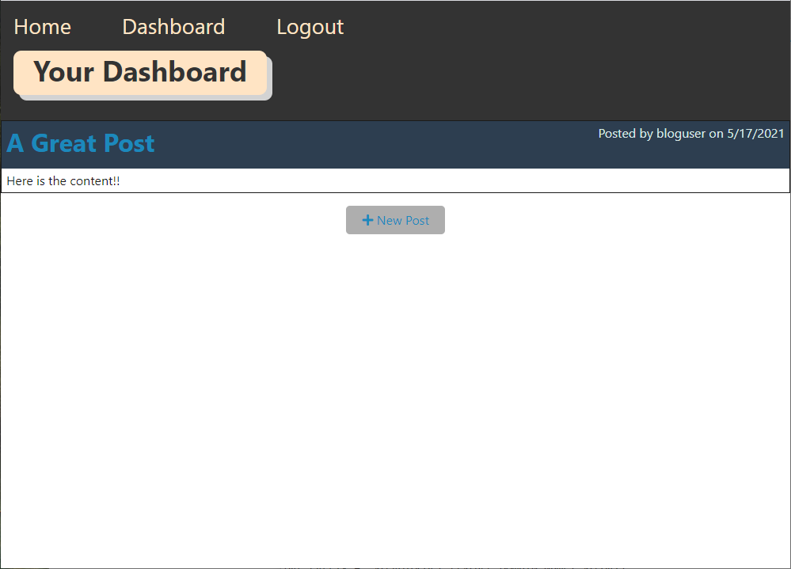
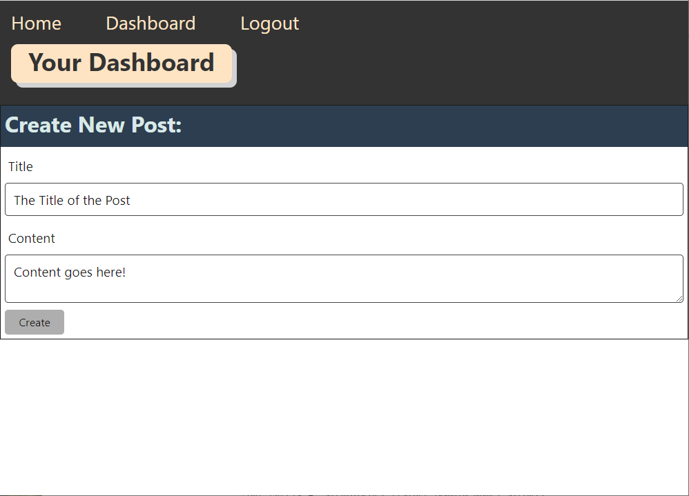

# Tech Blog

## Description

A blog site to publish blog posts and comments.

## Table of Contents 

* [Website](#Website)

* [Usage](#Usage)

* [License](#License)

* [Repository](#Repository)

* [Questions](#Questions)

## Website:

[https://murmuring-oasis-66556.herokuapp.com/](https://murmuring-oasis-66556.herokuapp.com/)

## Usage

View all posts and add comments on the homepage.  Add new posts and update previous ones on the dashboard.  The following images show the web application's appearance.

## License:

This app is licensed under the MIT license.

## Repository:

[https://github.com/jrdrenth/TechBlog](https://github.com/jrdrenth/TechBlog)

## Questions:

If you have any questions, please contact me at john.drenth@gmail.com.  My github profile can be found at [https://github.com/jrdrenth/](https://github.com/jrdrenth/).
